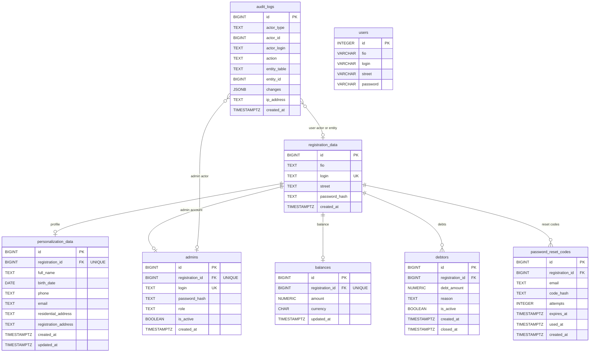
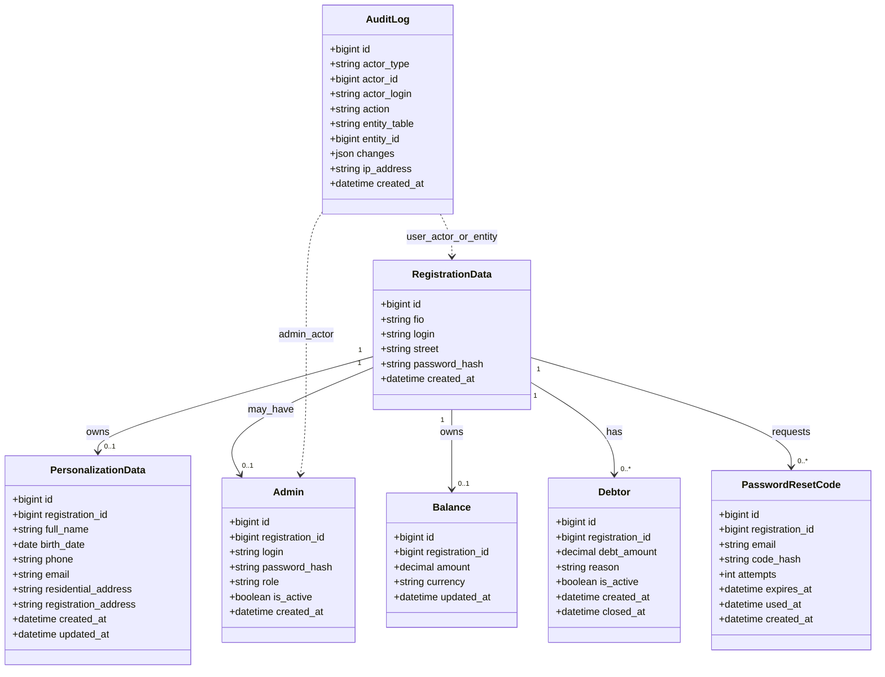
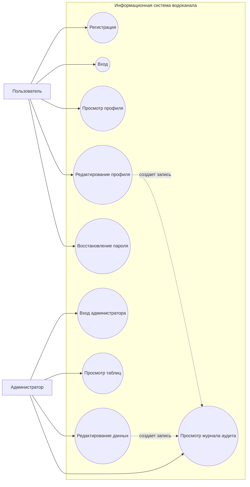
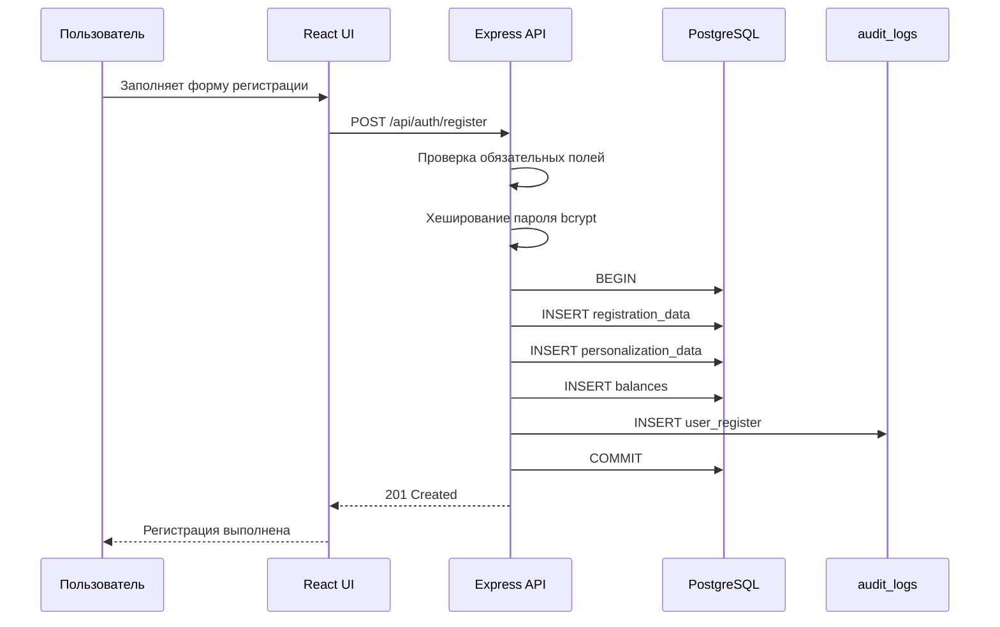
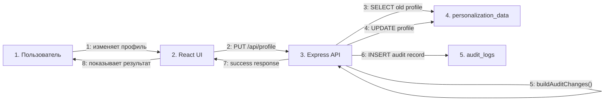
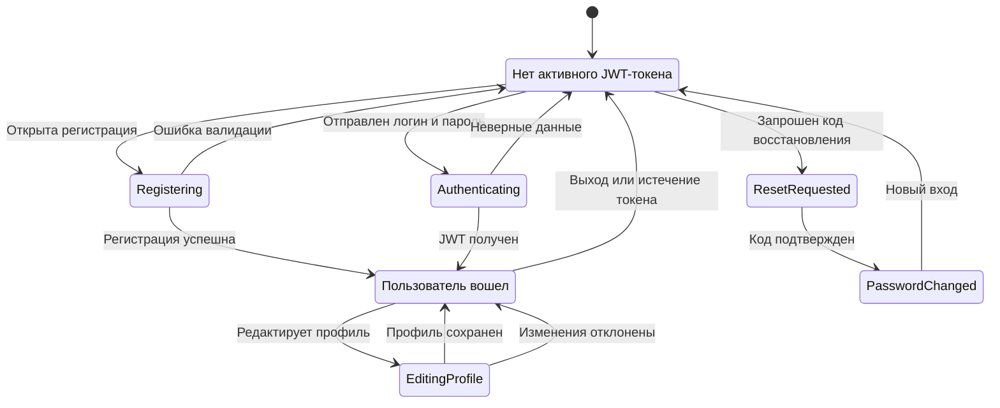
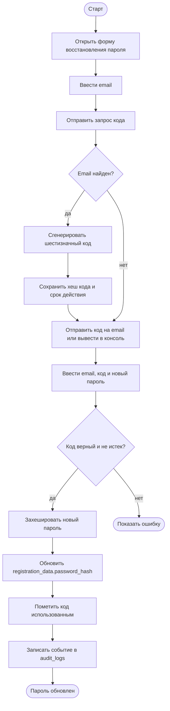
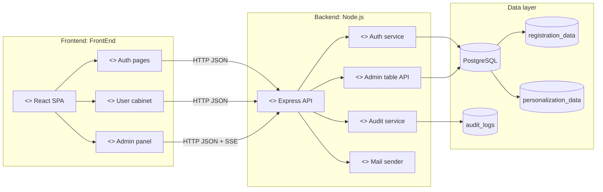
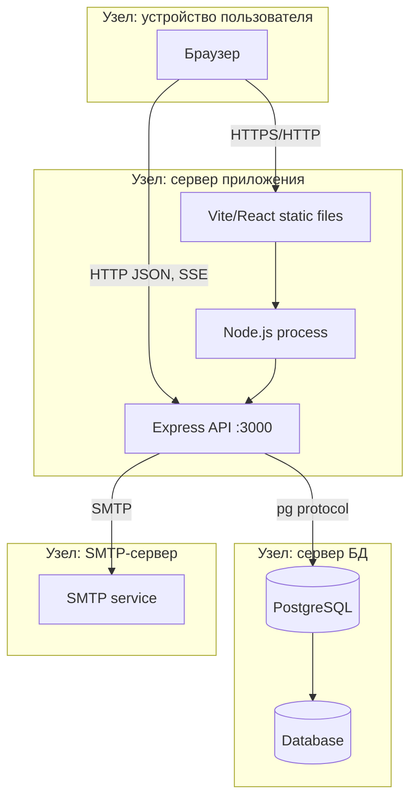

# UML-диаграммы проекта для Obsidian

Файл рассчитан на Obsidian: все блоки ниже оформлены как `mermaid` и отображаются в режиме чтения. Для строгих UML-нотаций, которых нет в Mermaid напрямую, использован совместимый формат `flowchart`.

## ER-диаграмма базы данных

## Диаграмма классов

## Диаграмма вариантов использования

## Диаграмма последовательностей

## Диаграмма кооперации

## Диаграмма состояний

## Диаграмма деятельности

## Диаграмма компонентов

## Диаграмма развертывания

